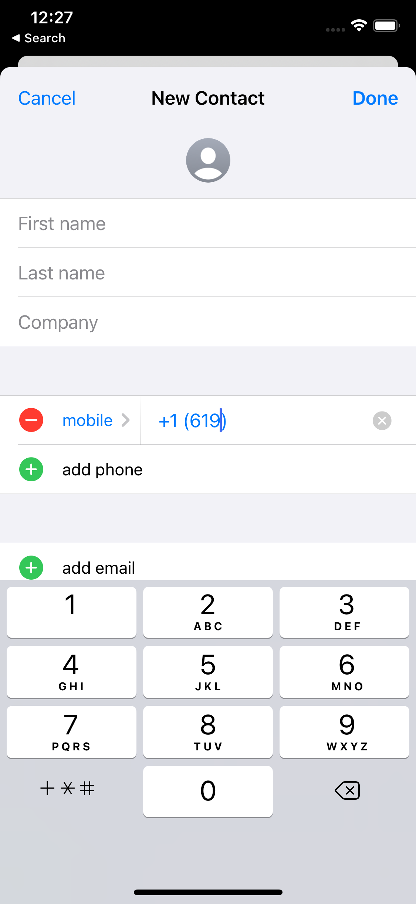

# Remaining specs summary

1. The binding `text` variable shouldn't be formatted. It should only appear formatted to the user as they type. For example: 

```swift
@State var text = ""
var body: some View {
	iPhoneNumberField("", text: $text)
		.onEditingEnded { print(text) } // "+16198675309"
}

```

2. `.maxDigits(_:)` should be renamed to `.characterLimit(_:)`.

3. There are several lingering formatting problems between the Contacts app and `iPhoneNumberField`. For example, with the number +44023456789012

1 | 2
:-------------------------:|:-------------------------:
 | 

This probably pops up in many places, and may be a quick fix. I remember reading in the `PhoneNumberKit` docs that there is a difference between international and local formatting. So it might be that. But in either case, the formatting should work exactly like the "add phone number" field in the Contacts app. The app is available in the simulator for testing.

4. Try formatting this number in the contacts app: +16198675309.

3 | 4 | 5
:-------------------------:|:-------------------------:|:-------------------------:
 |  | 

Notice how the parentheses appear right away, at first with 2 spaces, then 1, then none. The cursor remains in the proper place between the parentheses. This is a very important use case for American numbers, and pops up again in examples such as +44 numbers that begin with a 0, as shown above. When the user deletes, it works as expected, always deleting a number rather than a space or a parenthesis.

5. We agreed that abbreviated names are unnecessary. But the programmer should still be able to access the country name as a `String` and the emoji flag as a `String`. The easiest way to do this might be to just allow an optional binding, such as is done with the number:

```swift
@State var text = ""
@State var flag = ""
@State var country = ""
var body: some View {
	iPhoneNumberField("Phone", text: $text, flag: $flag, country: $country)
		.onEditingEnded { print("\(text), \(flag), \(country)") } // "+16198765309, 🇺🇸, United States"
}
```

6. The `.keyboardType(_:)` modifier should be deprecated just like the `.textContentType(_:)` modifier.

7. There should be an additional `.style(_:)` modifier that defaults the text field style just like these images.

| 6 |
|:-------------------------:|
|  |

The `.style(_:)` modifier should work in both light and dark mode as shown. It should also take an optional parameter `withBackground:` `Bool` that defaults to `false`, but when set to `true`, shows the background as indicated in the images.

The `.style(_:)` modifier should also style the flag sheet as shown.